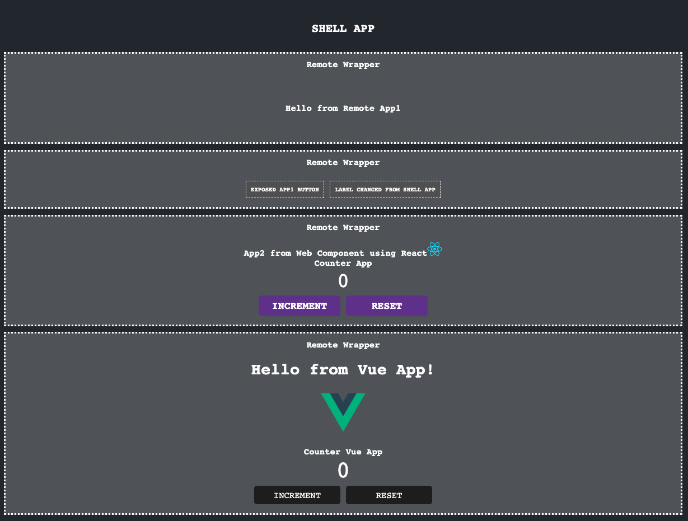

# Microfrontend POC using React

This is a microfronted POC using React as shell application and ModuleFederationWebpack plugin.

## Architecture

Shell App containing other modules (Running at port 3000) [React]
  - App1: Exposed App1 component and Button component [React] (Running at port 3001)
  - App2: Exposed App2 as Web Component [React] (Running at port 3002)
  - App3: Exposed App2 as Vue component app [Vue] (Running at port 3003)

## How to run

To load the entire app, each module should be app and running. Each module can be serve using next command: `npm start`

Shell App can be accesed through port 3000

## Preview

